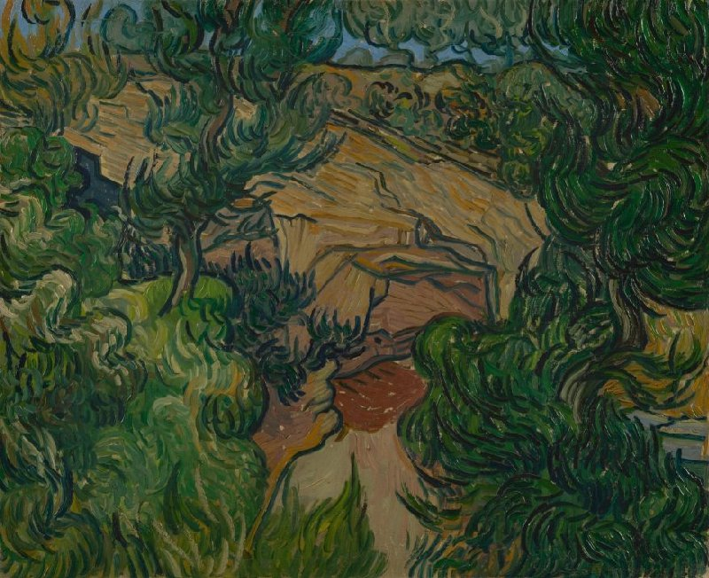
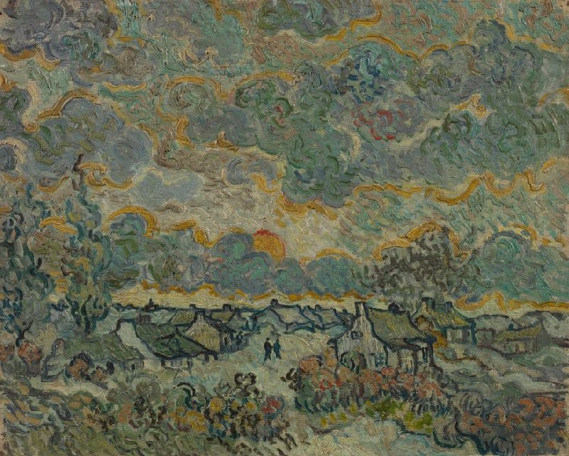

## Introduction

Last winter, I noticed a tree at the corner of a crossroad, which I walked past frequently. The species is unknown to me. Its trunk, with dry, furrowed bark, leaned forward at about a five-degree angle. The top of it was a cluster of stumps; perhaps because it obstructed pedestrians, its twigs had been cut down to just a few, leaving it bare without any leaves. Additionally, it is often surrounded by trash and fecal matter. I felt that this tree was unhappy, and I developed a strong sense of empathy for it. One day, in a moment of realization, I understood that this tree was a projection of my own feelings: I was unhappy. I wished to live somewhere comfortable, but I couldn’t due to many practical restrictions. Unintentionally, I made this tree a symbol of myself.

There was another reason for my empathy. This tree bears a strong physical resemblance to the tree in Vincent van Gogh’s painting, *The Sower* (see Figure.1). If I were a tree, I would love to live in *The Sower*, where I could bask in warmth under the “[immense] lemon yellow disc” of the setting sun and experience only the farmer’s humming and the gentle breath of the wind in a simple wheat field in Arles, south of France (van Gogh, 1888). Could this projection of emotion have happened to van Gogh as well when he was painting the tree? Was the tree, or he, truly happy?

He must have thought about the tree’s happiness, for it has absolute agency in this painting: it is located in the foreground and it’s been emphasized by van Gogh through the use of dark colors. Inspired by Japanese woodcuts, van Gogh’s way of depicting this tree renders it two-dimensional, as if the tree is unrelated to the spatial depth in the background (Van Gogh Museum, n.d.-b). Meanwhile, this tree is not entirely separated from the rest—its secondary branches create arcs that resonate with the round shape of the sun.

Mentioned in the House-Tree-Person Test proposed by John Buck, the tree is the element that “[conveys] to the examiner the subject’s felt impression of himself in relation to his environment” (Buck, 1948). Thinking in this manner, one can quickly perceive van Gogh’s state of mind: he was partially disengaged from the world around him and longed for resonance. Like every young Impressionist of the 19th century, van Gogh initially lived in Paris, the then-art center of the world. However, the hectic city life and competitive atmosphere quickly led him to feel numb and to desire the peaceful countryside (Van Gogh Museum, n.d.-b.). In February 1888, van Gogh moved to Arles, a southern French town. He was alone then, away from his peers who spoke critically about his work. Vincent expressed his yearning for company in a letter to Theo van Gogh, his younger brother and the art dealer selling van Gogh’s paintings: “You couldn’t imagine how pleased I am that you have painters with you and aren’t staying alone in the apartment” (van Gogh, 1888). It couldn’t be purely coincidental that this is the same letter where van Gogh first mentioned The Sower and this tree.

To summarize, it is very likely that art, for van Gogh, is a medium to express his emotions, and potentially, a way of healing. However, there’s almost nothing attested by first-hand evidence—even with an archive that is more comprehensive than those of other artists during van Gogh’s time, there’s no direct statement from him about the relationship between his art-making journey and the healing power of art-making. Only in the early years of his artistic career, van Gogh mentioned his preference for a style “that is realistic and yet done with sentiment” (van Gogh, 1882). This suggests that the art created by van Gogh is not about realism, but expressionism— “an exploration of the artist’s inner world”, which is briefly addressed in Malchiodi’s “The Art Therapy Sourcebook”(Malchiodi, 2007). By combining analyses of the artist’s paintings, his well-documented biography, and his letters, I aim to gain insight into how exactly the emotional expression through art could be a therapeutic process for Vincent van Gogh. 

## Biography: A Tormented Life

Van Gogh’s life experience was both tumultuous and brief. Before his brother Theo encouraged him to pursue painting, van Gogh followed the family tradition of studying theology. After a series of academic and career failures, he began to systematically study painting under his brother's encouragement. At the age of 27, he apprenticed with Anton Mauve, and, influenced by the artistic atmosphere in Paris, gradually began to develop his own style (Van Gogh Museum, n.d.-a). Although Impressionism was starting to gain approval during that era, van Gogh’s work remained largely unrecognized. Compared to his peers (such as Monet), he didn’t have a solid foundation and the popularity that came from early realism. Caught in the whirlpool of Paris, he shifted from enjoyment to a desire to escape. Thus, he fled to Arles. However, Arles soon ceased to be a sanctuary. One day in December 1888, after a dispute with his friend Gauguin, van Gogh impulsively severed his left earlobe. At this point, he was formally diagnosed with epilepsy, a neurological disorder causing seizures, hallucinations, and delusions (Nolen et al., 2020). In 1889, he was admitted to the Saint-Paul-de-Mausole psychiatric hospital in Saint-Rémy-de-Provence (Van Gogh Museum, n.d.-c). After a year of treatment, van Gogh was released. He then moved to the small town of Auvers-sur-Oise, not far from Paris, in May 1890. Two months later, van Gogh shot himself in the abdomen in a wheat field and passed away two days later in the company of Theo. He lived to be only 37 years old. 

I want to focus on the final two years of van Gogh’s life, when he was in Saint-Rémy and Auvers, from 1889 to 1890. These two years were both Vincent van Gogh’s most productive years and also the years of his fluctuating mental state.

## New Beginnings at Saint-Rémy-de-Provence: Art, Therapy and Sky

When van Gogh was in Saint-Rémy, despite the recurrence of mental episodes that hindered his ability to make art physically, he initially stayed positive about his condition and continued creating paintings. Besides the excitement generated by relocation, one cause for the transformation of his attitude is the effect of being in a group with people of similar conditions, which is similar to what happens in group therapy. Here, van Gogh feared less about his madness, as he saw people experiencing similar episodes and how the rest of the group was quick to intervene. The universality of the patients’ experiences with mental illness reassured him that he wouldn’t need to suffer alone as he did before, and he could feel no shame in his difference. With a light sense of humor, he called it “true friendship” and was delighted that he could eventually talk to someone who wasn’t afraid of him, even when they “[didn’t] reply except in incoherent sounds” (van Gogh, 1889). 

Van Gogh also shifted his perspective on mental illness thanks to this new environment. He no longer felt repulsion in discussing artists with psychosis; instead, he resonated with these artists and addressed those mental conditions as “serene bearing” (van Gogh, 1889). With a growing sense of self-esteem, van Gogh started to reflect on the environment around him through art without melancholy and horror. Although his activity space was initially restrained within the asylum, he was able to find enjoyment in the details of its overgrown garden. For example, one painting made during this period was a giant moth (see Figure 2). This moth was carefully painted, with every detail clean and sharp. The background of this painting was filled with blooming flowers, lush leaves, and bright red fruits, suggesting a sense of nourishment. When painting this moth, van Gogh discovered a passion and respect for life. In his letter, van Gogh expressed sympathy for the moth, as he had to kill it to paint it (van Gogh, 1889).

One noteworthy aspect of van Gogh’s experience in Saint-Rémy is the positive impact of his physical confinement, which can be understood from the perspective of art therapy. During his hospitalization, van Gogh was restricted from exploring the countryside alone. Therefore, most of the time he painted in his ward and in his studio (which was a vacant ward) rather than outdoors. This limitation transformed his creative environment into a relatively safe and supportive space for introspection and imagination, rather than a space filled with too many stimuli. This change in working space induced an important shift in his artistic approach: he relied more on his imagination and subjective processing of the initial sketch. It allowed him to further explore his emotions and somatic knowledge through reflection. As mentioned in “The bodymind model: A platform for studying the mechanisms of change induced by art therapy,” art-making makes negative emotional experiences less fearful to engage with by boosting emotional awareness and acceptance through representations in art (Czamanski-Cohen & Weihs, 2016). Thus, the art-making process under a safe, confined space became a therapeutic process for van Gogh, lessening the fear of madness which preoccupied him while activating self-awareness about emotional fluctuations. 

It was in this new way of practicing that van Gogh created his most famous painting, The *Starry Night* (see Figure 3). This painting is an imagination built on minimal real references: despite the mountains on the horizon, which could be viewed from van Gogh’s ward window, everything else is a product of van Gogh’s imaginative mind. From the perspective of art therapy, the abstract quality of the subjects can be used as a vehicle to understand the artist. In “Abstract Imagery in Art Therapy: What Does It Mean?”, Michael J. Hanes states that abstraction is used by clients as a way to “[embody] ideas and feelings that had not been sufficiently worked over internally to be communicable” (Hanes, 1998). That is, while the abstraction may appear random at first, upon closer inspection, one might find a hidden image or meaning.

While there are many abstract visual elements to be discussed in *Starry Night*, I would like to focus only on the component of the sky because, despite the change of subjects, the sky is the only recurring element running from the start of his career to its end. By analyzing the relationship between the sky and the surrounding elements depicted in van Gogh’s paintings, one can explore his psychological state. Although van Gogh had not yet experienced a relapse during the creation of *Starry Night* in June, perhaps this fear still haunted him. In his letters, van Gogh reassured his worried brother Theo, saying, “Don’t be afraid that I would ever venture onto dizzy heights of my own free will; unfortunately, whether we like it or not, we’re subject to circumstances and to the illnesses of our time” (van Gogh, 1889). This statement reveals van Gogh’s sense of inability to control the potential madness that loomed over him. In the painting, this sense of powerlessness is projected onto the small town: van Gogh presents a serene night in the countryside from an angle that is above the town yet far below the skyline, showcasing the collision between the tranquil night of the countryside and the dynamic movement of the stars. Through the swirling patterns and bold visualization of the stars’ illuminance, van Gogh created a commotion among the stars that is too grand for the humans beneath them to perceive.

At the same time, van Gogh still held a glimmer of hope, as he mentioned in his letters, “But with all the precautions I’m now taking, it will be difficult for me to relapse” (van Gogh, 1889). On one hand, the colors he chose—bright yellows and blues—are refreshing and carry positive connotations (see Figure 3). On the other hand, considering van Gogh’s early studies in theology, it is likely that he recognized the sky as a symbol of heaven and God’s presence. Although he mentioned in a letter to his brother Theo that this painting is not religious, subconsciously, van Gogh may still have associated the sky with mighty, uncanny celestial entities and thus a symbol of hope (van Gogh, 1889).

## The Setting of the Sun: Deterioration and Recovery (in Question)

Unfortunately, van Gogh’s mental crises came and went just like how the sky went from clear to obstructed in ebbs and flows. Just one month after he completed *Starry Night*, van Gogh’s illness returned. This can be seen in his painting *Entrance to a Quarry*, created before the onset of his episode, where he made an effort to externalize his inner discomfort: the trees in the painting begin to grow irregularly, resembling flames that flicker wildly across the canvas. The sky, which symbolizes hope, is also obscured by the thicket of trees (see Figure 4). 

During his struggle against illness, van Gogh described his experience: “For these days, without anything to do and without being able to go into the room he had allocated me for doing my painting, are almost intolerable to me” (van Gogh, 1889). This statement indirectly illustrates his dependence on artistic creation. For van Gogh, painting served as the most crucial form of art therapy, allowing him to find purpose in life and build a secure self-esteem through the creative process. In other words, van Gogh was constantly trying to save himself through painting. In “Art Therapy: Drawing on the Past and the Present,” the author Malchiodi also mentions that “van Gogh’s work comes from emotional suffering”, and many artists consider suffering a source of inspiration (Malchiodi, 2007).

As time passed, van Gogh’s emotions gradually changed during his stay in the asylum. His condition worsened, especially during a crisis that lasted for two months starting in February, which left him physically and mentally exhausted. During this crisis, van Gogh released his painful emotions through painting, creating several works inspired by memories, including *Reminiscence of Brabant* (see Figure 5).

Just as changes in a patient’s emotional state are revealed through the content of their artworks, van Gogh’s sky can also reflect the changes in his emotional landscape. In this painting, like in his earlier work, *Entrance to a Quarry*, the sky is not clear; heavy clouds shroud the earth, and the setting sun is obscured, seemingly having lost its ability to warm the land. Van Gogh had lost hope and his expectations for the future. In his letters, he pleaded with his family to send him past works, hoping to draw inspiration from the stories of the past (van Gogh, 1890). This stands in stark contrast to his earlier feelings upon arriving at the asylum, when he could find beauty in the desolate garden. Consequently, with his family’s permission, van Gogh left the asylum in May 1890 after spending a year in Saint-Rémy.

## Final months

The last two months of Vincent van Gogh’s life were spent in Auvers-sur-Oise. Having just emerged from the aimlessness of his crises, van Gogh became extremely productive. During these two months, he created approximately 80 oil paintings, along with countless sketches. It seemed that he had regained his former enthusiasm for creation after leaving the asylum. In his paintings, the prominence of the sky gradually diminished, and only a few works featured celestial bodies. This represents two possibilities: first, van Gogh’s change in perspective, similar to the fresh sense of novelty he experienced upon arriving at the mental hospital in Saint-Rémy, may have driven this shift. Practically, his focal point shifted to the more detailed ground. The second possibility is a change in van Gogh’s mindset. In the asylum in Saint-Rémy, he initially had enough confidence in his treatment, which was reflected in his work, where the sky, as a symbol of hope, was depicted in great expressive detail. However, after enduring crisis after crisis, van Gogh gradually became disillusioned. His expectations for the future became increasingly bleak, leading to fewer and more coarse depictions of the sky. At this point, art perhaps no longer held therapeutic effects but rather served to express his emotions outwardly.

*Wheatfield with Crows* is one of the last three paintings created by Vincent van Gogh (see Figure 6). The sky in this painting reveals a subtle sense of despair: its colors are as deep as midnight, with a hazy sun or moon hanging low on the horizon. Flocks of crows fly over the fields, gradually merging into the sky. Besides the degradation of his mental health after his detachment from the asylum, which is mentioned above, some external factors created more challenges to the stability of van Gogh’s mindset. Soon after Vincent van Gogh moved to Auvers, his brother Theo felt ill, causing some stress to van Gogh as he was very afraid of being separated from his brother and being too much of a burden (van Gogh, 1890). Van Gogh’s letters to his brother also confirm this sentiment and elaborate on the reasons for his despair: “I feared–not completely but a little nonetheless–that I was a danger to you, living at your expense ” (van Gogh, 1890). While art has helped van Gogh attain the purpose of his life, van Gogh’s financial reliance on his brother, once confronted with disability, started to shatter his self-esteem as an artist. This time, he seemed convinced that he was less like an artist bringing beauty to the world but a danger, or an exploiter of the people around him.

Not long after, van Gogh took his own life in the wheat field.

## Conclusion

In 1882, when van Gogh was just starting to pursue art, he wrote to Theo in a letter saying: “What am I in the eyes of most people? A nonentity or an oddity or a disagreeable person—someone who has and will have no position in society, in short a little lower than the lowest. Very well—assuming that everything is indeed like that, then through my work I’d like to show what there is in the heart of such an oddity, such a nobody. This is my ambition, which is based less on resentment than on love in spite of everything, based more on a feeling of serenity than on passion. Even though I’m often in a mess, inside me there’s still a calm, pure harmony and music. In the poorest little house, in the filthiest corner, I see paintings or drawings. And my mind turns in that direction as if with an irresistible urge” (van Gogh, 1882). 

This quote offers a holistic view of Vincent van Gogh’s artistic practice and his take on art’s healing power. There was first a sense of alienation and low self-worth, a definition of himself as a “nonentity” or “oddity.” Despite these feelings, he expresses a desire to reveal the depth of his emotions and experiences through his art. This desire for self-expression underscores the therapeutic potential of art as a means of exploring and affirming his identity. This could be seen most obviously in his first few months in Saint-Rémy, when he began identifying with the rest of the patients in the mental hospital. Next, van Gogh also admitted that although he was often tormented by mental illness, he nevertheless pursued “calm, pure harmony and music” (van Gogh, 1882). In his art practice under physical confinement in the hospital, his self-reflective work helped him clarify his emotions and somatic knowledge. Lastly, his ability to see beauty in every detail of reality contributed to his consistency in making more paintings. In his final months, characterized by despair and disillusionment, it was art-making that let him vent out negative emotions. While looking at the suicidal cause of his death may make people assume that van Gogh was eventually defeated, one cannot ignore all the efforts he made in self-salvation which resulted in the creation of the most breath-taking masterpieces of humanity. 

## References:

Buck, J.N. (1948), The H-T-P test. J. Clin. Psychol., 4: 151-159. 

Czamanski-Cohen, J., & Weihs, K. L. (2016). The bodymind model: A platform for studying the mechanisms of change induced by art therapy. The Arts in Psychotherapy, 51(1), 63–71.

Hanes, M. J. (1998). Abstract Imagery in Art Therapy: What Does it Mean? Art Therapy, 15(3), 185–190.

Malchiodi, C. A. (2007). The Art Therapy Sourcebook (2nd ed., Vol. 2, pp. 21–43). Mcgraw-Hill.

Nolen, W. A., van Meekeren, E., Voskuil, P., & van Tilburg, W. (2020). New vision on the mental problems of Vincent van Gogh; results from a bottom-up approach using (semi-)structured diagnostic interviews. International Journal of Bipolar Disorders, 8(1).

Van Gogh, V. (1882, January 9). No.199, Letter to Theo van Gogh. In Van Gogh Museum & Huygens Institut (Eds.), Vincent van Gogh Letters. Vangoghletters.org.

Van Gogh, V. (1882, July 21). No.249, Letter to Theo van Gogh. In Van Gogh Museum & Huygens Institut (Eds.), Vincent van Gogh Letters. Vangoghletters.org.

Van Gogh, V. (1889, May 23). No. 776, Letter to Theo van Gogh. In Van Gogh Museum & Huygens Institut (Eds.), Vincent van Gogh Letters. Vangoghletters.org.

Van Gogh, V. (1888, November 21). No.722, Letter to Theo van Gogh. In Van Gogh Museum & Huygens Institut (Eds.), Vincent van Gogh Letters. Vangoghletters.org.

Van Gogh, V. (1889, June 18). No.782, Letter to Theo van Gogh. In Van Gogh Museum & Huygens Institut (Eds.), Vincent van Gogh Letters. Vangoghletters.org.

Van Gogh, V. (1889, August 22). No. 797, Letter to Theo van Gogh. In Van Gogh Museum & Huygens Institut (Eds.), Vincent van Gogh Letters. Vangoghletters.org.

Van Gogh, V. (1890, April 29). No. 864, Letter to Anna van Gogh-Carbentus and Willemien van Gogh. In Van Gogh Museum & Huygens Institut (Eds.), Vincent van Gogh Letters. Vangoghletters.org.

Van Gogh, V. (1890, July 10). No.898, Letter to Theo van Gogh and Jo van Gogh-Bonger. In Van Gogh Museum & Huygens Institut (Eds.), Vincent van Gogh Letters. Vangoghletters.org.

Van Gogh Museum. n.d.-a. First steps as an Artist. Van Gogh Museum.

Van Gogh Museum. n.d.-b. From Dark to Light. Van Gogh Museum.

Van Gogh Museum. n.d.-c. South of France. Van Gogh Museum.
