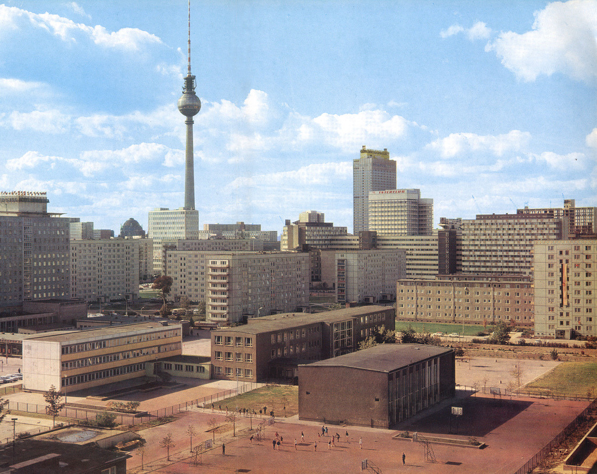
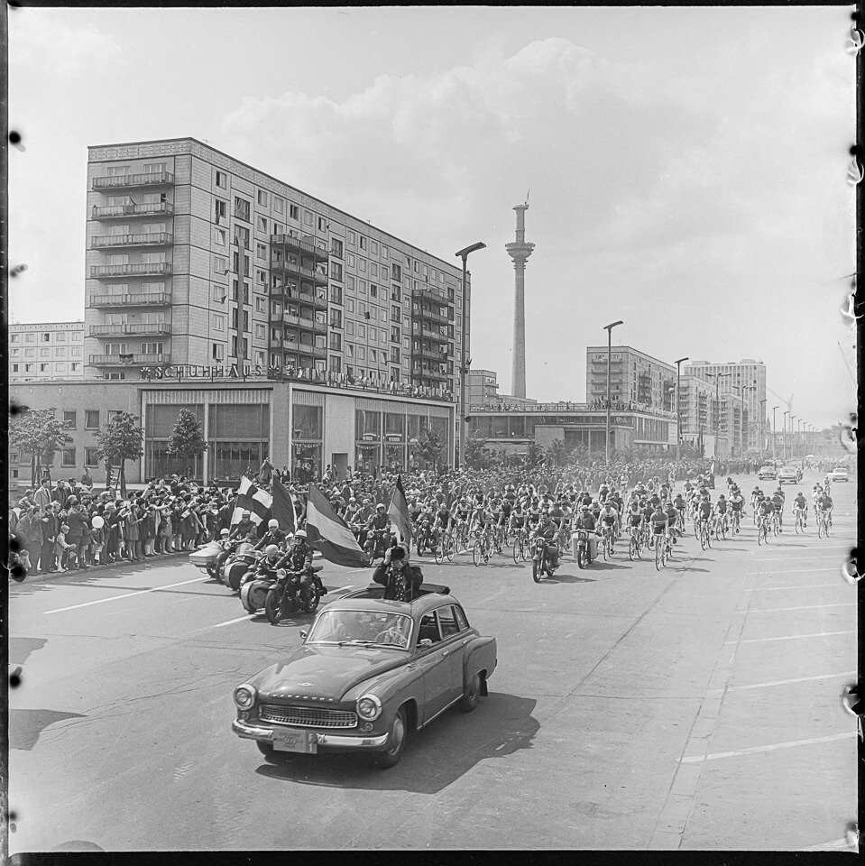
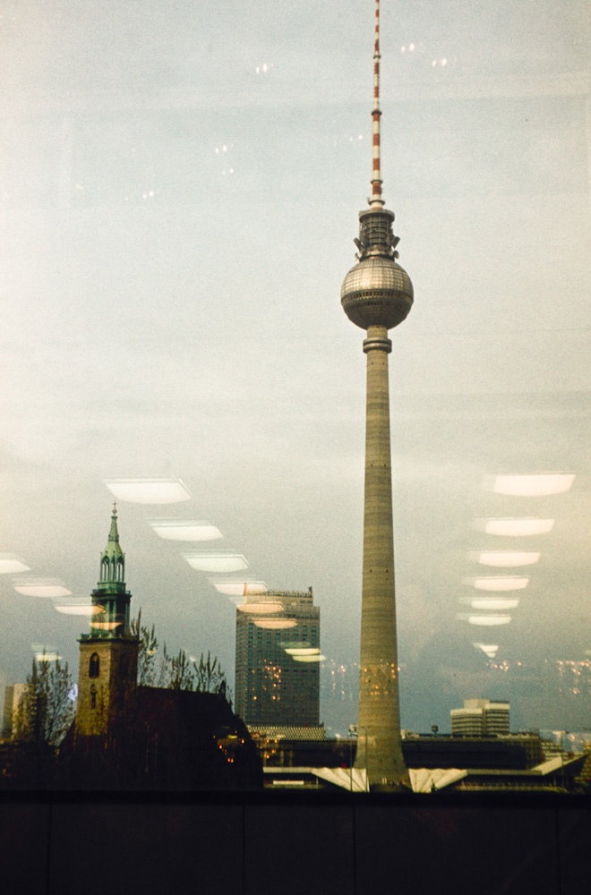

During the fall semester of my junior year, I participated in the NYU Berlin Study Away Program. Berlin, a city deeply burdened by its history, much of it dark and troublesome, intrigued me. I was fascinated by how Berlin and its people handle historical traces, especially architectural sites that strongly reference specific periods. The **Fernsehturm**, or Berlin TV Tower, serves as an example marking the era of the Cold War and the city's division at that time.

While I was in Berlin, I researched the history of the Fernsehturm and wrote a short essay about it. And I'm now sharing it with you.

I never go up the Fernsehturm, Television Tower of Berlin. 

This isn’t to say I dislike it - I do. 

It is the tallest building on Berlin’s skyline. In the Mitte, you could almost see it everywhere. It is the largest pin on the city’s map. Staying in Berlin as a foreigner, the tower serves as a comforting beacon. 

It reminds me of the mountain that was the back of my home. My life orbited the mountain: eastward to school, westward for evening walks, north to the library, and south to the old town. 

I didn’t find my mountain in New York. Fortunately, I find it here. The Fernsehturm, with its towering pillar, is like an artificial hill rising from the city's heart, broadcasting radio and television signals from its lofty heights. Yet, instead of ascending this modern mountain, I weave my life around its base. It is reassuring that when looking up, the tower is just, there. 

I don’t want to situate myself to a destination that is a dead end. Up in the sky in a closed space, you lose the ability to see further up there, up to the sky, where the imagination of the universe starts to emerge. Or, you fail to see further down here, into the foreign earth below your feet where history resides. Berlin's intricate layers reveal themselves not from a lofty perch but within the embrace of its streets. Aloft, one beholds the city in its entirety, a singular entity, yet the narratives each structure harbors dissipate with the altitude. It is among the city's pulse that the confluence of history and the present unfolds—a mosaic of tales rather than a monolith of experience. 

The Fernsehturm itself is also not a dead-end. Its symbolism evolves alongside shifts in power and perspective. During the Cold War, it served as a symbol of the modernity and strength that the GDR sought to project, with its sphere echoing the 1st Earth satellite, Sputnik. 

However, following the fall of the Berlin Wall and Germany's reunification, the tower took on new meaning. It transitioned into a pivotal element of East German heritage, embodying a complex, divided history now integrated into the broader narrative of a reunified Germany. 

In the 21st century, the presence of a towering landmark has become almost a necessity for major cities. In this context, the Fernsehturm has emerged as the defining landmark of Berlin, signifying its status as a global metropolis.

I don’t want to go up a landmark. Landmark reminds me of the dual feelings of alienation and belonging. The word “landmark” implies a certain distinction, setting the structure apart from its architectural brethren and accentuating its unique status. In essence, a landmark is objectified, becoming more associated with the abstract essence of the place it symbolizes rather than its practical function within that space.

For the Fernsehturm, this detachment from its surroundings is deliberate. When the East German Government decided to erect this broadcasting tower in 1965, it was a clear statement of intent. The tower was meant to be more than a functional structure; it was to be a beacon of socialist progress and technological prowess. The transformation of its immediate environment further cemented this intention. Therefore, the GDR cleared a significant area in the Mitte district, removing historical medieval buildings to make way for a modern urban plaza. 

This action underscored the Fernsehturm's role as an emblem of the new era, distinct from the architectural and historical context of its location. Thus, the Fernsehturm was, in a sense, born a familiar outsider in its own land. Its origin, purpose, and transformative impact on its vicinity marked it as an entity set apart, a symbol superimposed upon the city’s fabric.

It is me. The city, compared to the melting pot of New York City, often heightens my awareness of being an outsider. But I am not a foreign visitor staying for only three days; I am also not a long-term resident. I am stuck in between. I would think about whether I am more privileged than tourists taking selfies in front of the Fernsehturm, or if should I be modest about my opinion of Berlin in front of her inhabitants for whom the city's landmarks have blended into the backdrop of daily life. My relationship with the Fernsehturm becomes a metaphor for my journey in Berlin - an emblem of both connection and detachment, a landmark that anchors as much as it alienates, embodying the ever-shifting sands of identity in a city that is both familiar and foreign.

There were allegedly discussions immediately after German reunification, about whether the building should be erased along with other East German traces in Berlin. But the architectural simplicity of the Fernsehturm — its geometric clarity and the imposing nature of its mass — made it survive all quarrels. As other landmarks succumb to obsolescence, decay, or lose their relatability, the Fernsehturm’s straightforward yet monumental design transcends specific historical contexts, allowing it to maintain relevance. Isn’t he fortunate? Isn’t he unlucky? 

Buildings stand as custodians of history. One may ponder their origins, their architects, and the evolution of their roles over time. Each is an entity with its complexity. In Berlin, the Fernsehturm stands tall, a colossus amidst the cityscape. Somehow from the perspective of an outsider, the tower has witnessed the shift of powers and cultural perceptions. It is reinterpreted and redefined by time. Perhaps one day, it would be a definite outsider to the flying houses around it. And people would start mocking: isn’t it just a giant disco ball stabbed by a javelin?