# Watercolor: Making the darkest black

Ever since I started concentrating on watercolor painting two years ago, I’ve confronted this problem many times: how to create a rich and deep black color. While the transparency and luminosity have always been the charm of this medium, sometimes darkness needs to take place for the brightest colors to shine. 

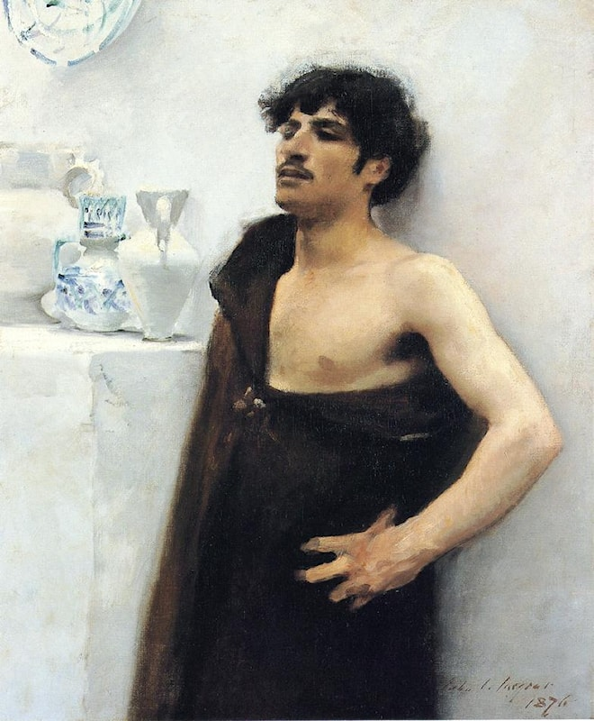

## Premade Black Colors
There are many premade black colors in watercolor. Although some say using black is a bad habit, I use black colors a lot because they are very convenient for addressing small areas. Below are the ones I use:

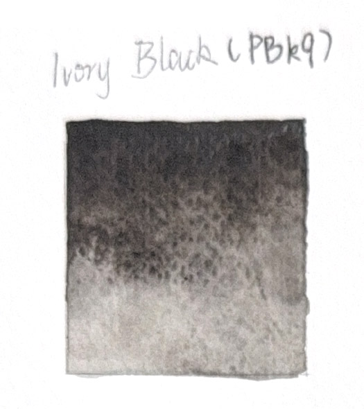
Ivory Black (PBk9): Ivory Black, or Bone Black, gets its color from burnt animal bones. It is warm-toned and granulating, providing an interesting texture.
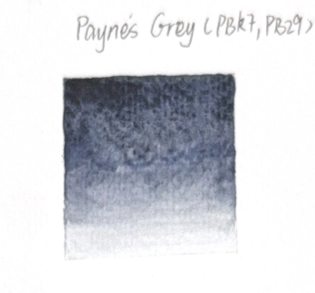
Payne’s Grey (PBk7, PB29): As suggested by the Color Index Number, this pigment contains PB29, thus it shows a black color leaning toward blue.
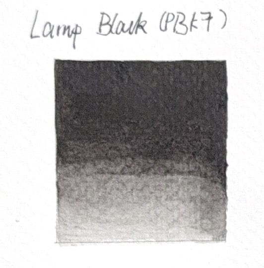
Lamp Black (PBk7): Lamp Black is my go-to if I just need a flat black color. It is a neutral tone, meaning that I can usually turn it into a warmer or cooler tone by simply adding other colors.

P.S. I included the Color Index numbers because, while paints from different brands share the same commodity name, their pigments might differ. For example, the Payne’s Grey I bought from Winsor & Newton, produced in China, uses PBk7 and PB29, while the Golden QoR one uses PBk7, PB15:3, and PV19. Thus, their actual colors, upon close observation, are different. This is important when discussing the mixing of colors later on.

Additionally, I also use black sumi ink that I bought from China. Its color is similar to Ivory Black (PBk9) because it is also made from burnt animal bones. However, it doesn’t granulate and thus serves as a non-granulating alternative to Ivory Black. 
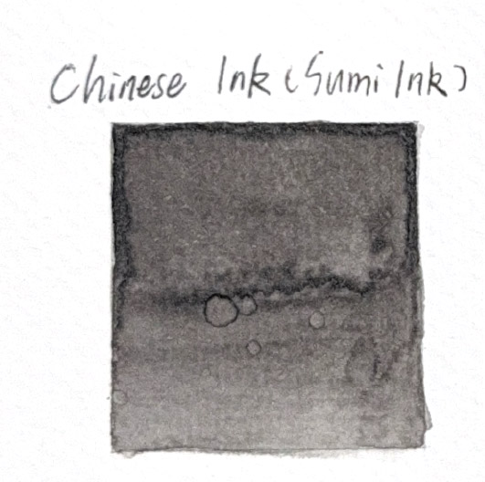
Compared to watercolor, ink has less gum and thus flows better. Sometimes, I mix it with other black colors in watercolor to increase the fluidity. For example, the fuzzy black cat is painted with Lamp Black mixed with sumi ink.

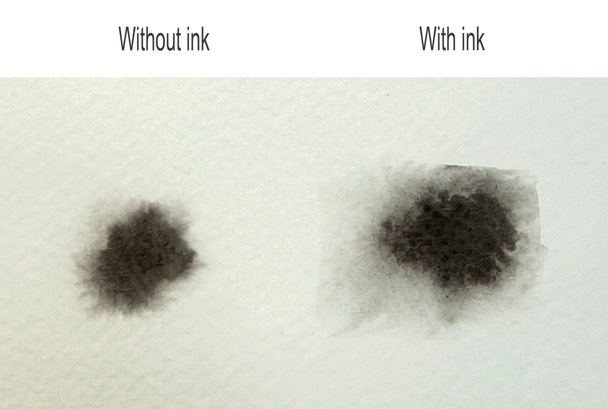
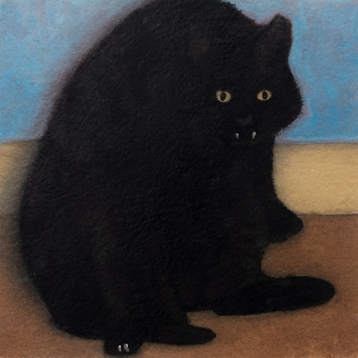

Black gouache is very helpful if a large area of void-like black is desired. It is generally easier to achieve the same darkness with gouache than with watercolor, using less paint. However, gouache can be limiting in its ability to achieve gradation, as shown in the picture below. Thus, I prefer to use it when the area needs no gradation or blending, such as a background.

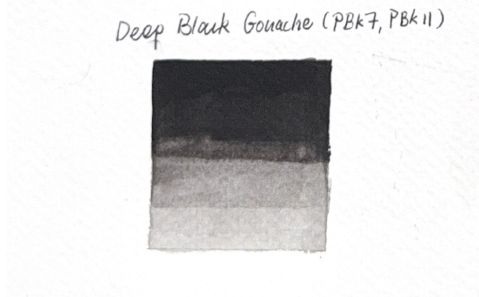
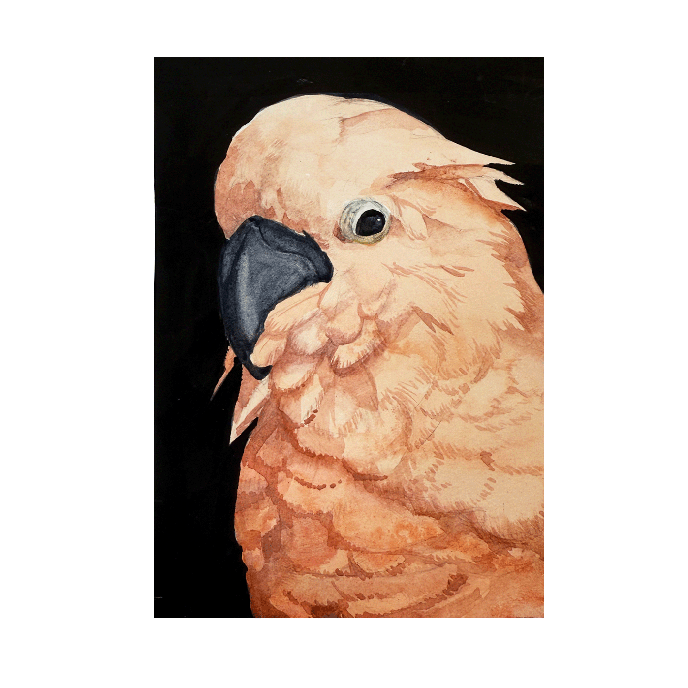

## Mixing Black
Although premade black colors are convenient to use, sometimes they lack the character needed in a painting. Instead of a pure flat black color, black can also show depth and interact with the rest of the palette.

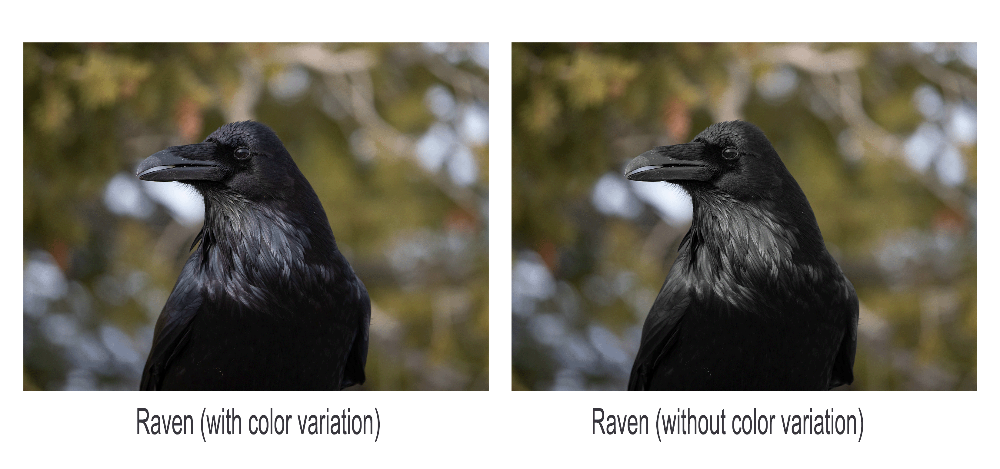

Mixing black, in the simplest form, is to mix two complementary colors on the color wheel. In watercolor, the basic mechanism is the same, but it must consider the physical properties of the pigments and of the binder (occasionally). Although I have tried the classical combination of Ultramarine and Burnt Umber (or Burnt Sienna) that I learned in acrylics, I am eager to explore what else is possible. Therefore, I experimented with color mixtures in a chart and selected the combinations that produce black. I ultimately chose 36 colors, excluding some that, at first glance, do not produce black.

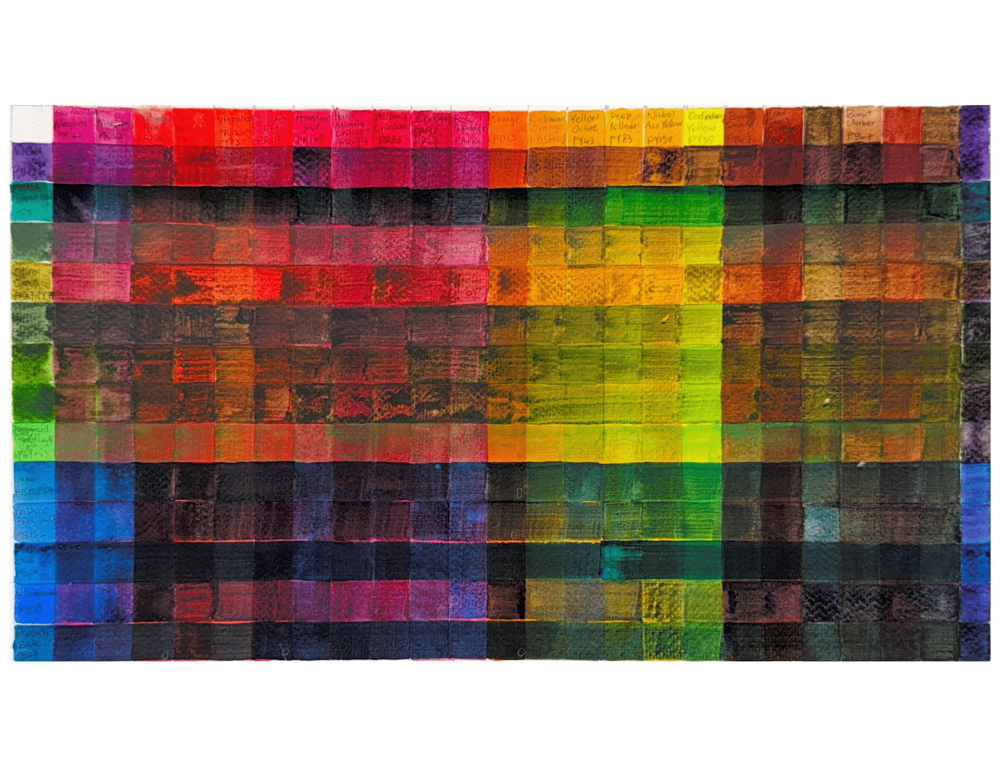

Three things stand out to me in this chart: 

First, some paints behave unusually when mixed. The most noticeable ones are my green paints. Some colors, like Oxide of Chromium (PG17) and Ultramarine (PB29), seem to float instead of mixing, while Phthalo Green (PG7) and Phthalo Blue (PB15, or PB15:3) seep in quickly. This is due to the staining properties of pigments. Staining pigments, such as the phthalos, tend to bind deeply with the paper fibers. Non-staining pigments, like Oxide of Chromium (PG17) and Ultramarine (PB29), behave more like a glaze on top of the other paints.

Second, colors such as Terra Verte (PBr7, PG7) and Vandyke Brown (PBr7, PBk7) appear to have a sheen. This is a sign of excessive Arabic gum on the surface. In my case, this was caused by the binder separating from the pigment in the tube because the paints remained unused for over two years. When the paint was squeezed out, the Arabic gum flowing at the mouth of the tube was mixed with less pigment than usual, resulting in a faint wash of color and a sheen. To resolve this, I stuck a sewing needle into the tube and stirred the paint to rebind the ingredients. In other cases, when the paint is too thick, Arabic gum tends to accumulate and leave an undesirable sheen.

Lastly, QoR watercolor paints using Aquazol binder can have difficulty layering with traditional watercolor paints that bind with Arabic gum. In this chart, QoR paints, such as Pyrrole Red Light (PR255), Nickel Azo Yellow (PY150), and Phthalo Blue (PB15:3), do not layer as nicely as the traditional ones.

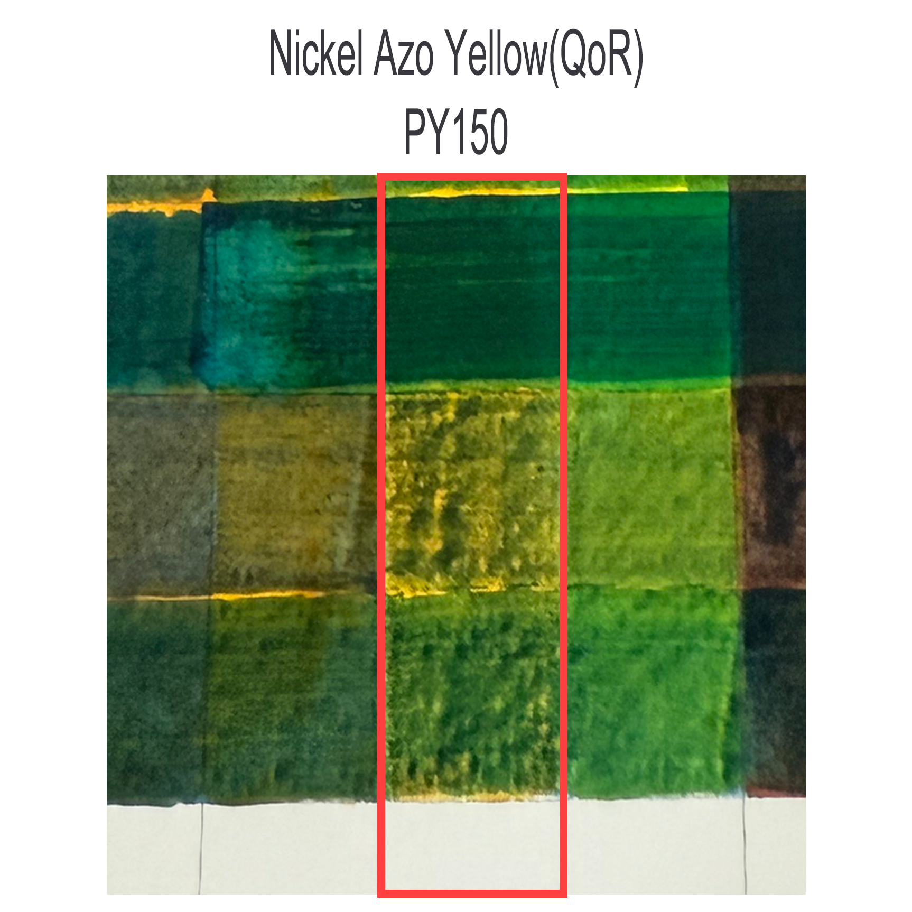
However, this doesn’t appear to be a problem when paints are pre-mixed and then applied. Thus, if layering watercolor is a must, you should definitely consider the possibility of getting a muddy result.

The chart illustrates possibilities for mixing black, and I have chosen the ones I prefer. The picture below shows the full list.

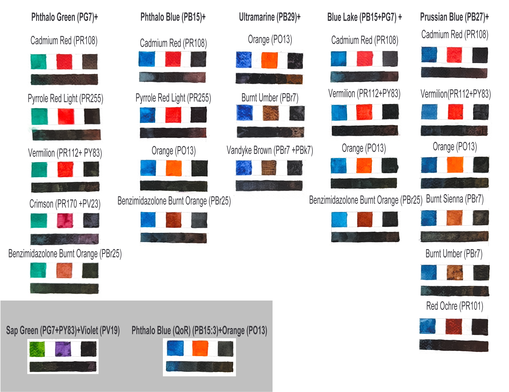

To my surprise, the illuminative orange, PO13, which initially appeared to be too bright, works brilliantly with all the blues (I will definitely try to create more paintings with this color).

## Conclusion

TL;DR Here’s the final list of recipes for mixing black:

#### Phthalo Green (PG7) + Pyrrole Red Light (PR255)/any red pigment leaning toward crimson (PR)
#### Phthalo Blue (PB15) + Pyrrole Red Light (PR255)/any red pigment leaning toward orange (PO)
#### Ultramarine (PB29) + Burnt Umber (PBr7)/Burnt Sienna (PBr7)
#### Prussian Blue (PB27) + Burnt Sienna (PBr7)

This list considered three factors: 

1. the availability of this color across different brands and 
2. whether this color, under the same marketing name, has the same pigment (the Color Index number) across brands. 
3.It is also critical to recognize whether this color is a single pigment or not. This is important because some colors under one marketing name, consisting of multiple pigments, can appear significantly different across brands due to the various ratios of the pigments. (It is VERY IMPORTANT to identify paint by pigment, not the marketing name!)

This is all I have to share today. I hope it can inspire people to create their own black colors and EXPERIMENT (the best way to learn about watercolor)!
